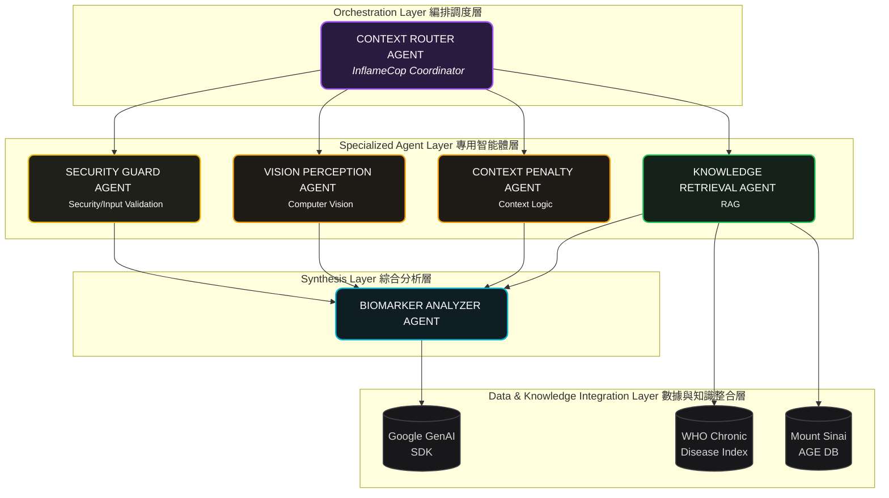
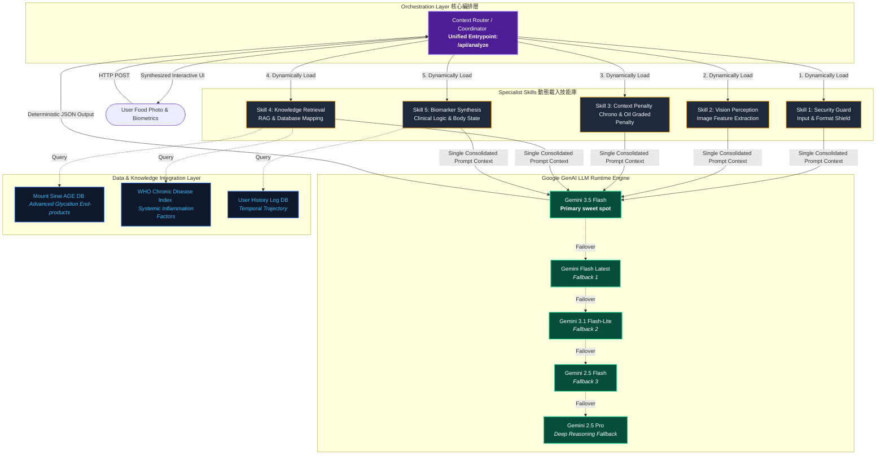

# 1. Executive Summary
## Core Concept & Value
**InflameCop** is a multi-agent system that autonomously audits cellular inflammation risks from food photography by combining multi-modal perception with context-aware functional medicine reasoning.

| Section | Description |
| :--- | :--- |
| **Market Opportunity** | **$4.3T global wellness market.** 68% of urban professionals suffer from fatigue or brain fog, which is clinically rooted in **Neuroinflammation** and **Mitochondrial Dysfunction**. Yet 100% of mass-market nutrition apps miss these cellular inflammation triggers. |
| **Solution Type** | Privacy-first personal health concierge powered by a specialized **3-agent system (Security Guard, Context Router, Medical Analyzer)**. |
| **Key Innovation** | Context-aware molecular logic that dynamically infers hidden restaurant cooking patterns combined with zero-friction image-payload guardrails. |
| **Time to Value** | Reduces 10-minute stressful manual meal-logging or blind guesswork to a **< 5-second personalized biological verdict**. |
| **Cost Efficiency** | $0 user maintenance or app subscription fees, costing only **~$0.005 token overhead** per dish analysis using `gemini-2.5-flash`. |

---

# 2. Problem Statement: The Hidden Cellular Fire

> **Urban professionals aren't just tired—their cells are on fire.** Modern meals are packed with hidden, highly inflammatory restaurant oils and toxic AGE surges, yet 100% of legacy trackers are completely blind to these molecular triggers, forcing users to count calories while leaving their cellular health unprotected.

* **The Silent Epidemic**: Chronic inflammation drives **50% of global deaths**, causing **68% of urban professionals** to suffer from daily fatigue and "brain fog."
* **The Dietary Triggers**: **70%–80%** of these conditions are diet-driven. Modern restaurant dining exposes consumers to a toxic **20:1 Omega-6 ratio** (via cheap seed oils) and a **2,200% surge in Advanced Glycation End-products (AGEs)** from high-temperature frying, which actively shuts down cellular energy (mitochondria).
* **The Legacy Blindspot**: In a $4.3T wellness market, 100% of mass-market nutrition apps are completely blind to these molecular triggers. They force users into tedious calorie-counting while letting hidden inflammatory damage slip through.
---
# 3. Solutions & Why Agents
## Solutions
## Why Agents?
## Key Features

---
# 4. Architecture

## Diagram 1 - 4 layers structure diagram

### Agent Specifications


## Diagram 2 - MCP

```mermaid

graph TD
    %% Define Light-Themed Styles for GitHub
    classDef main fill:#f3e8ff,stroke:#7C3AED,stroke-width:2px,color:#4c1d95;
    classDef skill fill:#e0f2fe,stroke:#0284c7,stroke-width:1.5px,color:#0369a1;
    classDef context fill:#d1fae5,stroke:#059669,stroke-width:1.5px,color:#065f46;
    classDef state fill:#fee2e2,stroke:#dc2626,stroke-width:1.5px,color:#991b1b;
    classDef report fill:#fef3c7,stroke:#d97706,stroke-width:2px,color:#92400e;
    classDef group fill:#f8fafc,stroke:#cbd5e1,stroke-width:1px,color:#64748b;

    %% User Input
    User[👤 貼入食物照片 & 勾選標籤] --> Core

    %% Single Agent Core
    subgraph CoreAgent [單一通用智能體 Single Agent Core]
        Core["🧠 InflameCop 通用 Agent 核心<br/>Powered by Gemini 3.5 Flash"]
    end
    class Core main;
    class CoreAgent group;

    %% Dynamic Skills Registry 
    %% 將巢狀子圖平鋪或透過節點連線修正，確保 GitHub 解析成功
    subgraph MealContext [外食/家常情境標籤 Skills]
        S3[⚠️ 3. 種子油危害與脂質氧化分析]:::context
        S4[🫒 4. 優質冷壓油品加分最佳化]:::context
        S5[🔥 5. 高溫油炸 AGEs 毒性計算]:::context
        S6[🌿 6. 豐富多酚抗氧化補償計算]:::context
        S7[🍱 7. 剩菜與組胺累積免疫耐受度]:::context
        S8[🥫 8. 罐頭與加工防腐劑/雙酚A負荷]:::context
    end
    class MealContext group;

    subgraph Biometrics [生理與生物特徵標籤 Skills]
        S9[💪 9. 運動後黃金期蛋白質合成修復]:::state
        S10[😴 10. 熬夜高皮質醇糖盾防護]:::state
        S11[🌙 11. 深夜褪黑素與消化減緩警戒]:::state
        S12[🧘 12. 腸胃敏感黏膜保護與 neba-neba 加分]:::state
    end
    class Biometrics group;

    subgraph BaseSkills [基礎防禦與判定 Skills]
        S1[🔍 1. 非食物圖像防禦與過濾]:::skill
        S2[🍳 2. 外食與家常 Risk 梯度評分]:::skill
    end
    class BaseSkills group;

    %% Relationships & Flow (修正連線至具體第一個節點，避免 GitHub 報錯)
    Core -->|1. 影像校驗| S1
    Core -->|2. 環境判定| S2
    Core -->|3. 動態加載情境| S3
    Core -->|4. 動態加載生理狀態| S9

    %% Aggregated Output Flow
    S1 & S2 & S3 & S4 & S5 & S6 & S7 & S8 & S9 & S10 & S11 & S12 --> Combine[智能綜合輸出]
    Combine --> Output[📋 5秒極速發炎警察臨床報告]:::report
    class Combine main;
```

```mermaid
graph TD
    %% Define Light-Themed Styles
    classDef coordinator fill:#f3e8ff,stroke:#a855f7,stroke-width:2px,color:#4a044e;
    classDef registryGroup fill:#f8fafc,stroke:#cbd5e1,stroke-width:1.5px,color:#475569;
    classDef rowGroup fill:#f1f5f9,stroke:#e2e8f0,stroke-width:1px,color:#64748b;
    classDef skill fill:#e0f2fe,stroke:#0284c7,stroke-width:1.5px,color:#0369a1;
    classDef external fill:#d1fae5,stroke:#059669,stroke-width:1.5px,color:#065f46;

    %% Orchestration Layer
    subgraph Orchestration_Layer [Orchestration Layer]
        Coordinator["🤖 CONTEXT ROUTER & COORDINATOR AGENT<br/>(Gemini 3.5-Flash)"]
    end
    class Coordinator coordinator;

    %% Dynamic Skills Registry (Light Background)
    subgraph Skills_Registry [Dynamic Skill Registry - Activated on Demand]
        
        subgraph Row1 [1. Core Defense & Parsing]
            S1["🛡️ 1. Security Guard & Input Validator"]
            S2["👁️ 2. Computer Vision Ingredient Parser"]
            S3["🩺 3. Chronic Disease Guidelines Matcher"]
            S4["🔥 4. Glycation Risk Estimator (AGEs)"]
        end
        
        subgraph Row2 [2. Clinical Metrics & Alignment]
            S5["📊 5. Dietary Inflammatory Index (DII) Engine"]
            S6["⏰ 6. Chrono-Nutrition & Circadian Alignment"]
            S7["🧬 7. Personal Biomarker Profiler"]
            S8["🦠 8. Gut Microbiome Symbiosis Matcher"]
        end
        
        subgraph Row3 [3. Trends & Synthesis]
            S9["🌿 9. Antioxidant & Phytonutrient Evaluator"]
            S10["💧 10. Hydration & Electrolyte Balancer"]
            S11["📈 11. Historic Trend Analyzer"]
            S12["✍️ 12. Clinical Narrative Synthesizer"]
        end
        
    end
    class S1,S2,S3,S4,S5,S6,S7,S8,S9,S10,S11,S12 skill;
    class Row1,Row2,Row3 rowGroup;

    %% Data & External Tool Integration Layer (MCP / SDK)
    subgraph External_Layer [Data & Tool Integration Layer]
        GenAI["⚡ Google GenAI SDK"]
        WHODB["📚 WHO Chronic Disease Index"]
        AGEDB["🧪 Mount Sinai AGE Database"]
        HistoryDB["💾 InflameCop Historic DB"]
    end
    class GenAI,WHODB,AGEDB,HistoryDB external;

    %% Relationships & Flow
    Coordinator -->|1. Detects Intent & Loads| Skills_Registry
    
    %% Dynamic Execution Bindings
    S1 -.->|Cleans & Validates| Coordinator
    S2 -.->|Extracts Culinary Features| Coordinator
    S3 -.-> WHODB
    S4 -.-> AGEDB
    S5 -.->|Calculates Inflammatory Potential| Coordinator
    S11 -.-> HistoryDB
    
    %% Final Synthesis Flow
    Skills_Registry -->|2. Aggregated Payloads| Coordinator
    Coordinator -->|3. Final Structured Synthesis| GenAI

    %% Apply Style Groups
    class Skills_Registry registryGroup;
    class External_Layer registryGroup;
```

```mermaid

graph TD
    %% Define Styles
    classDef coordinator fill:#4c1d95,stroke:#c084fc,stroke-width:2px,color:#fff;
    classDef skillGroup fill:#0f172a,stroke:#334155,stroke-width:1px,color:#94a3b8;
    classDef skill fill:#1e293b,stroke:#38bdf8,stroke-width:1.5px,color:#f8fafc;
    classDef external fill:#022c22,stroke:#10b981,stroke-width:1.5px,color:#ecfdf5;

    %% Orchestration Layer
    subgraph Orchestration_Layer [Orchestration Layer]
        Coordinator["🤖 CONTEXT ROUTER & COORDINATOR AGENT<br/>(Gemini 3.5-Flash)"]
    end
    class Coordinator coordinator;

    %% Dynamic Skills Registry
    subgraph Skills_Registry [Dynamic Skill Registry - Activated on Demand]
        S1["🛡️ 1. Security Guard & Input Validator"]
        S2["👁️ 2. Computer Vision Ingredient Parser"]
        S3["🩺 3. Chronic Disease Guidelines Matcher"]
        S4["🔥 4. Glycation Risk Estimator (AGEs)"]
        S5["📊 5. Dietary Inflammatory Index (DII) Engine"]
        S6["⏰ 6. Chrono-Nutrition & Circadian Alignment"]
        S7["🧬 7. Personal Biomarker Profiler"]
        S8["🦠 8. Gut Microbiome Symbiosis Matcher"]
        S9["🌿 9. Antioxidant & Phytonutrient Evaluator"]
        S10["💧 10. Hydration & Electrolyte Balancer"]
        S11["📈 11. Historic Trend Analyzer"]
        S12["✍️ 12. Clinical Narrative Synthesizer"]
    end
    class S1,S2,S3,S4,S5,S6,S7,S8,S9,S10,S11,S12 skill;

    %% Data & External Tool Integration Layer (MCP / SDK)
    subgraph External_Layer [Data & Tool Integration Layer]
        GenAI["⚡ Google GenAI SDK"]
        WHODB["📚 WHO Chronic Disease Index"]
        AGEDB["🧪 Mount Sinai AGE Database"]
        HistoryDB["💾 InflameCop Historic DB"]
    end
    class GenAI,WHODB,AGEDB,HistoryDB external;

    %% Relationships & Flow
    Coordinator -->|1. Detects Intent & Loads| Skills_Registry
    
    %% Dynamic Execution Bindings
    S1 -.->|Cleans & Validates| Coordinator
    S2 -.->|Extracts Culinary Features| Coordinator
    S3 -.-> WHODB
    S4 -.-> AGEDB
    S5 -.->|Calculates Inflammatory Potential| Coordinator
    S11 -.-> HistoryDB
    
    %% Final Synthesis Flow
    Skills_Registry -->|2. Aggregated Payloads| Coordinator
    Coordinator -->|3. Final Structured Synthesis| GenAI

    %% Apply Style Groups
    class Skills_Registry skillGroup;
    class External_Layer skillGroup;
```





```mermaid
graph TD
    classDef main fill:#7C3AED,stroke:#9F67FF,stroke-width:2px,color:#fff;
    classDef skill fill:#1F2937,stroke:#4B5563,stroke-width:1px,color:#E5E7EB;
    classDef state fill:#1E3A8A,stroke:#3B82F6,stroke-width:1.5px,color:#93C5FD;
    classDef context fill:#064E3B,stroke:#10B981,stroke-width:1.5px,color:#A7F3D0;
    classDef report fill:#0F172A,stroke:#F59E0B,stroke-width:2px,color:#FBBF24;

    User[👤 貼入食物照片 & 勾選標籤] --> Core[🧠 InflameCop 通用 Agent 核心<br/>Powered by Gemini 3.5 Flash]

    subgraph CoreAgent [單一通用智能體 (Single Agent Core)]
        Core
    end

    subgraph DynamicSkills [12 個動態載入的臨床分析技能 (Dynamic Skills)]
        S1[🔍 1. 非食物圖像防禦與過濾]:::skill
        S2[🍳 2. 外食與家常 Risk 梯度評分]:::skill
        
        subgraph MealContext [外食/家常情境標籤 Skills]
            S3[⚠️ 3. 種子油危害與脂質氧化分析]:::context
            S4[🫒 4. 優質冷壓油品加分最佳化]:::context
            S5[🔥 5. 高溫油炸 AGEs 毒性計算]:::context
            S6[🌿 6. 豐富多酚抗氧化補償計算]:::context
            S7[🍱 7. 剩菜與組胺累積免疫耐受度]:::context
            S8[🥫 8. 罐頭與加工防腐劑/雙酚A負荷]:::context
        end

        subgraph Biometrics [生理與生物特徵標籤 Skills]
            S9[💪 9. 運動後黃金期蛋白質合成修復]:::state
            S10[😴 10. 熬夜高皮質醇糖盾防護]:::state
            S11[🌙 11. 深夜褪黑素與消化減緩警戒]:::state
            S12[🧘 12. 腸胃敏感黏膜保護與 neba-neba 加分]:::state
        end
    end

    Core -->|1. 影像校驗| S1
    Core -->|2. 環境判定| S2
    Core -->|3. 動態加載情境| MealContext
    Core -->|4. 動態加載生理狀態| Biometrics

    DynamicSkills -->|智能綜合輸出| Output[📋 5秒極速發炎警察臨床報告]:::report

    class Core main;
```
---
# 4. The Build 
## 🛠️ Tech Stack
## Installation
## Usage
## Development Process

---
# n. Kaggle 5 Days Topics Coverage

---
# n. Next Steps

---
# n. Citation

---
# n. Q & A

