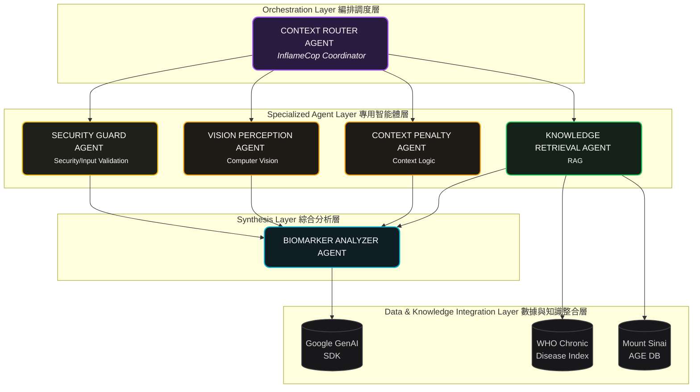

# 1. Executive Summary
## Core Concept & Value
**InflameCop** is a multi-agent system that autonomously audits cellular inflammation risks from food photography by combining multi-modal perception with context-aware functional medicine reasoning.

| Section | Description |
| :--- | :--- |
| **Market Opportunity** | **$4.3T global wellness market.** 68% of urban professionals suffer from fatigue or brain fog, which is clinically rooted in **Neuroinflammation** and **Mitochondrial Dysfunction**. Yet 100% of mass-market nutrition apps miss these cellular inflammation triggers. |
| **Solution Type** | Privacy-first personal health concierge powered by a specialized **3-agent system (Security Guard, Context Router, Medical Analyzer)**. |
| **Key Innovation** | Context-aware molecular logic that dynamically infers hidden restaurant cooking patterns combined with zero-friction image-payload guardrails. |
| **Time to Value** | Reduces 10-minute stressful manual meal-logging or blind guesswork to a **< 5-second personalized biological verdict**. |
| **Cost Efficiency** | $0 user maintenance or app subscription fees, costing only **~$0.005 token overhead** per dish analysis using `gemini-2.5-flash`. |

---

# 2. Problem Statement: The Hidden Cellular Fire

> **Urban professionals aren't just tired—their cells are on fire.** Modern meals are packed with hidden, highly inflammatory restaurant oils and toxic AGE surges, yet 100% of legacy trackers are completely blind to these molecular triggers, forcing users to count calories while leaving their cellular health unprotected.

* **The Silent Epidemic**: Chronic inflammation drives **50% of global deaths**, causing **68% of urban professionals** to suffer from daily fatigue and "brain fog."
* **The Dietary Triggers**: **70%–80%** of these conditions are diet-driven. Modern restaurant dining exposes consumers to a toxic **20:1 Omega-6 ratio** (via cheap seed oils) and a **2,200% surge in Advanced Glycation End-products (AGEs)** from high-temperature frying, which actively shuts down cellular energy (mitochondria).
* **The Legacy Blindspot**: In a $4.3T wellness market, 100% of mass-market nutrition apps are completely blind to these molecular triggers. They force users into tedious calorie-counting while letting hidden inflammatory damage slip through.
---
# 3. Solutions & Why Agents
## Solutions
## Why Agents?
## Key Features

---
# 4. Architecture

## Diagram 1 - 4 layers structure diagram

### Agent Specifications

## Diagram 2 - MCP

---
# 4. The Build 
## 🛠️ Tech Stack
## Installation
## Usage
## Development Process

---
# n. Kaggle 5 Days Topics Coverage

---
# n. Next Steps

---
# n. Citation

---
# n. Q & A

